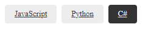

# `cool-tags`



A custom element to render a list of tags.

The `cool-tags` element is a custom element that renders a list of tags from a given JSON list.

## Usage

Include the required files in your HTML.

```html
<html>
  <head>
    <!-- Other stuff in head -->
    <!-- ... -->
    <link rel="stylesheet" href="path/to/cool-tags.html" />
  </head>
  <body>
    <!-- Other stuff in body -->
    <!-- ... -->
    <script src="path/to/cool-tags.js"></script>
  </body>
</html>
```

Use the `cool-tags` element in your HTML, providing a valid JSON list of tags as its inner content.

Each tag must have the required `id` and `label` properties.

```html
<cool-tags>
  [{ "id": "javascript", "label": "JavaScript"}, { "id": "python", "label":
  "Python"}, { "id": "c-sharp","label": "C#" }]
</cool-tags>
```

## Attributes

The `cool-tags` element accepts the following attributes:

| Name       | Type                    | Description                                                                                                                                                                                                               |
| ---------- | ----------------------- | ------------------------------------------------------------------------------------------------------------------------------------------------------------------------------------------------------------------------- |
| `strategy` | `'query' \| 'fragment'` | The navigation strategy to use when a tag is clicked. `query` appends the `name` query parameter with the `id` of the tag to the current url. `fragment` will append the tag `id` as a page fragment. Default is `query`. |
| `name`     | `string`                | The name of the query parameter when using the `query` `strategy`. Default is `tag`.                                                                                                                                      |

```html
<!-- For the location `www.example.com` -->

<cool-tags name="language" strategy="query">
  [
  <!-- Navigates to `www.example.com?language=javascript` -->
  { "id": "javascript", "label": "JavaScript" },
  <!-- Navigates to `www.example.com?language=python` -->
  { "id": "python", "label": "Python" },
  <!-- Navigates to `www.example.com?language=c-sharp` -->
  { "id": "c-sharp","label": "C#" }]
</cool-tags>

<cool-tags strategy="fragment">
  [
  <!-- Navigates to `www.example.com#javascript` -->
  { "id": "javascript", "label": "JavaScript"},
  <!-- Navigates to `www.example.com#python` -->
  { "id": "python", "label": "Python"},
  <!-- Navigates to `www.example.com#c-sharp` -->
  { "id": "c-sharp","label": "C#" }]
</cool-tags>
```

## Customisation

### Using Custom Styles

Use the following selectors to target and style the `cool-tags` element.

| Selector                      | Description                                           |
| ----------------------------- | ----------------------------------------------------- |
| `cool-tags`                   | The root element. By default, has no styling applied. |
| `cool-tags .tags`             | The tags container and parent element.                |
| `cool-tags .tags tag`         | The individual tag elements.                          |
| `cool-tags .tags tag > a`     | The inner link element.                               |
| `cool-tags .tags .tag.active` | The active tag element (using `query` strategy).      |
| `cool-tags .tags .tag:target` | The target tag element (using `fragment` strategy).   |

### Using Custom Variables

Override the following variables to change the default styling.

| Variable                  | Description | Default        |
| ------------------------- | ----------- | -------------- |
| `--tags-margin`           |             | `0`            |
| `--tags-padding`          |             | `0`            |
| `--tags-display`          |             | `flex`         |
| `--tags-wrap`             |             | `wrap`         |
| `--tags-flow`             |             | `row`          |
| `--tags-spacing`          |             | `0.5rem`       |
| `--tags-alignment`        |             | `flex-start`   |
| `--tags-item-alignment`   |             | `center`       |
| `--tag-display`           |             | `inline-block` |
| `--tag-background`        |             | `#ededed`      |
| `--tag-color`             |             | `#333333`      |
| `--tag-active-background` |             | `#333333`      |
| `--tag-active-color`      |             | `#ededed`      |
| `--tag-font-size`         |             | `0.8rem`       |
| `--tag-padding`           |             | `0.5rem 1rem`  |
| `--tag-border-radius`     |             | `0.25rem`      |
| `--tag-text-decoration`   |             | `underline`    |
